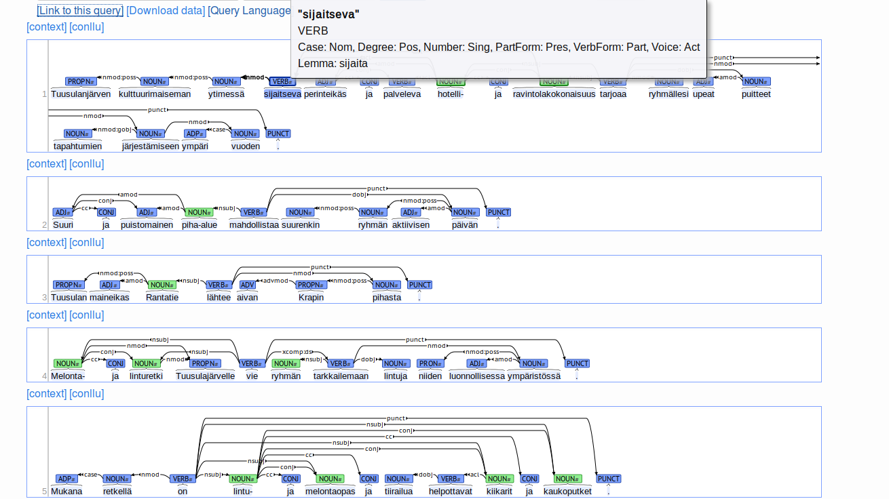

# Parser architecture

Almost every component of the parser is machine-learned on the [UD Finnish](https://github.com/UniversalDependencies/UD_Finnish) dataset, which evolved from the Turku Dependency Treebank TDT.

## Tokenization and sentence splitting

The tokenizer and sentence splitter are built by training the corresponding [Apache OpenNLP](https://opennlp.apache.org/) components, using the data in UD Finnish.

## Morphological tagging

The parsing pipeline produces a rather detailed morphological analysis using the standardized tagsets from [Universal Dependencies](http://universaldependencies.org/). Every word is given its lemma (base form), main POS (noun, verb, etc.), and a list of morphological tags. This is achieved by combining two components:

### OMorFi

The [OMorFi](https://github.com/flammie/omorfi) morphological analyzer is capable of analyzing the inflection of a wide coverage of Finnish words but since Finnish is highly ambiguous, for many wordforms it produces a number of plausible competing analyses. For examplke for the Finnish word *voi* we get the seven analyses below, all correct. A limitation of OMorFi is that for base forms not in its lexical database, it does not produce any analysis.

```
voida<V><Act><Ind><Prt><Sg3><cap>
voida<V><Act><Ind><Prs><Sg3><cap>
voida<V><Act><Imprt><Sg2><cap>
voida<V><Ind><Prs><ConNeg><cap>
voi<Interj><cap>
voi<Pcle><cap>
voi<N><Sg><Nom><cap>
```

### MarMoT

The [MarMoT](http://cistern.cis.lmu.de/marmot/) tagger is a statistical tagger trained to produce the correct analysis (set of tags) in the given context. For example, out of the seven analyses of *voi* above, it will choose the one which is appropriate for the given sentence context, choosing between the noun, the interjection, the particle, or the verbal readings. MarMoT will assign a plausible reading also for words which are not known in OMorFi. The script `omorfi_pos.py` in the parser takes care of the necessary processing to merge the information from OMorFi and MarMoT in the most optimal manner.

## mate-tools parser

The [mate-tools](https://code.google.com/archive/p/mate-tools/) is a dependency parser, once again trained on the UD Finnish data, which given the morphologically tagged text produces a dependency tree, which describes the structure of the sentence. This structure encodes the mutual dependencies between pairs of words in the sentence.

## CoNLL-U

The parser output is in the standard tab-delimited [CoNLL-U format](http://universaldependencies.org/format.html). For an English sentence, this format would look like such:


    1    They     they    PRON    PRP    Case=Nom|Number=Plur               2    nsubj    2:nsubj|4:nsubj
    2    buy      buy     VERB    VBP    Number=Plur|Person=3|Tense=Pres    0    root     0:root
    3    and      and     CONJ    CC     _                                  4    cc       4:cc
    4    sell     sell    VERB    VBP    Number=Plur|Person=3|Tense=Pres    2    conj     0:root|2:conj
    5    books    book    NOUN    NNS    Number=Plur                        2    obj      2:obj|4:obj
    6    .        .       PUNCT   .      _                                  2    punct    2:punct

## Example output for Finnish

A [live query](http://bionlp-www.utu.fi/dep_search/query?search=_%20%3Cnsubj%20_&db=PBV4&case_sensitive=True&hits_per_page=50) in the dep_search system (University of Turku).



